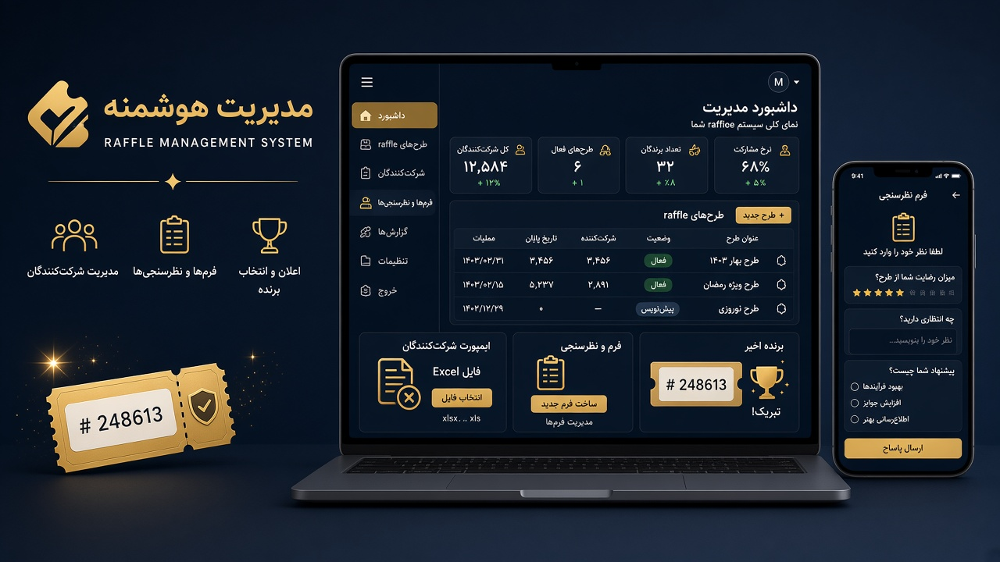

# نمونه کارهای KGSM

پورتفولیوی عمومی سامانه‌هایی که توسط **گروه برنامه‌نویسی کا جی اس ام** طراحی و پیاده‌سازی شده‌اند.

| سامانه | توضیح کوتاه |
| --- | --- |
| [سامانه قرعه‌کشی](projects/lottery-system/) | مدیریت طرح‌های قرعه‌کشی، شرکت‌کنندگان، ورود اکسل و پرسشنامه |

---

## سامانه قرعه‌کشی

سامانه کامل و مدرن برای مدیریت قرعه‌کشی‌ها با پنل مدیریت، ورود اطلاعات از Excel/CSV، پرسشنامه و گزارش‌گیری.

**جزئیات کامل:** [projects/lottery-system](projects/lottery-system/)

---

توسعه‌دهنده: گروه برنامه‌نویسی کا جی اس ام  
ایمیل: [unsystem1@gmail.com](mailto:unsystem1@gmail.com)
